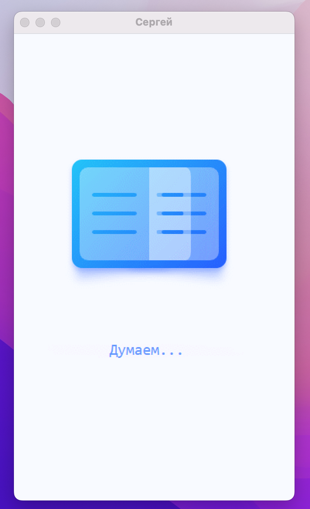
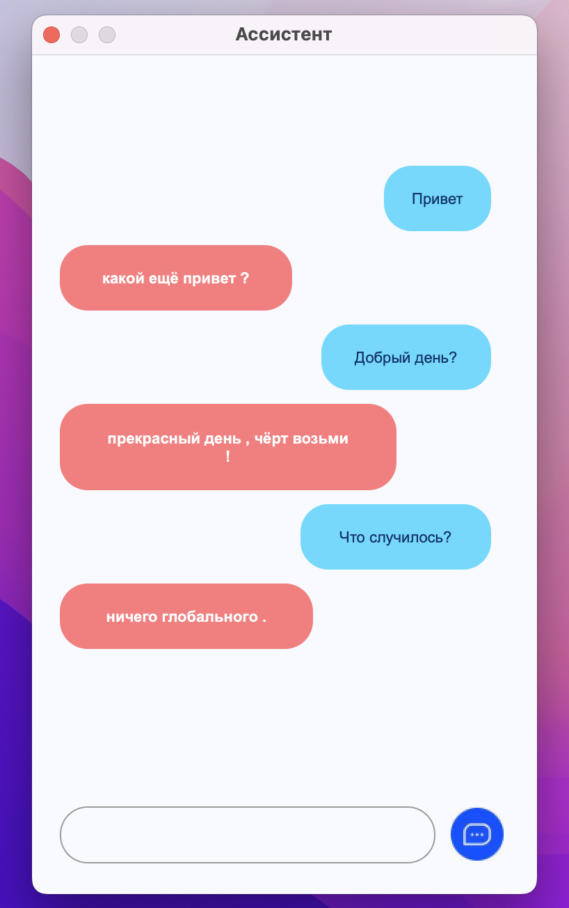

# Чат-бот Сергей

**Чат-бот с классификацией запросов.
Проигрывает музыку, показывает погоду.
Отвечает на ввод пользователя при помощи выбора наиболее похожего контекста и возвращения ответа из базы [good.tsv](res/classifiers/good.tsv)**

**Приложение содержит два экрана: Загрузка и Общение:**

 

 

**Погода парсится по API c 'world-weather.ru'. Музыка выбирается из директории res/Misic. Информация о композициях содержится в базе base.db**
